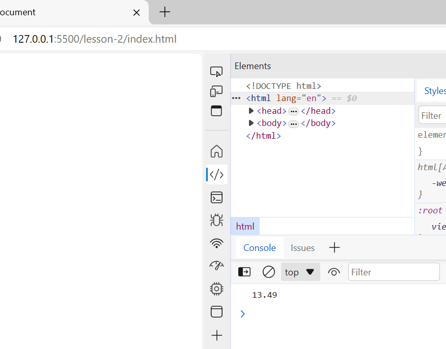
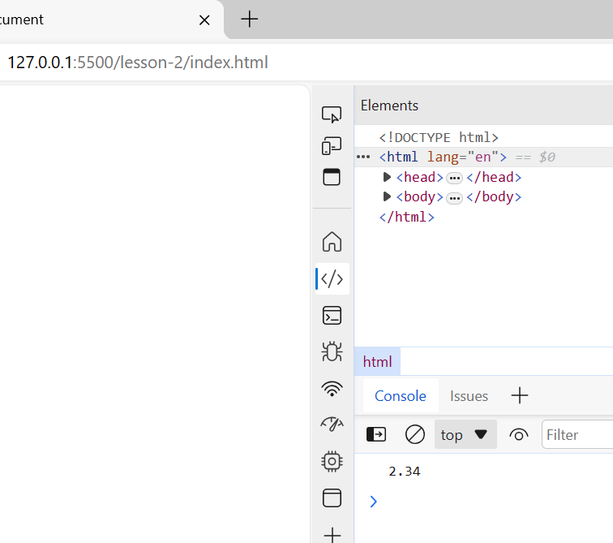
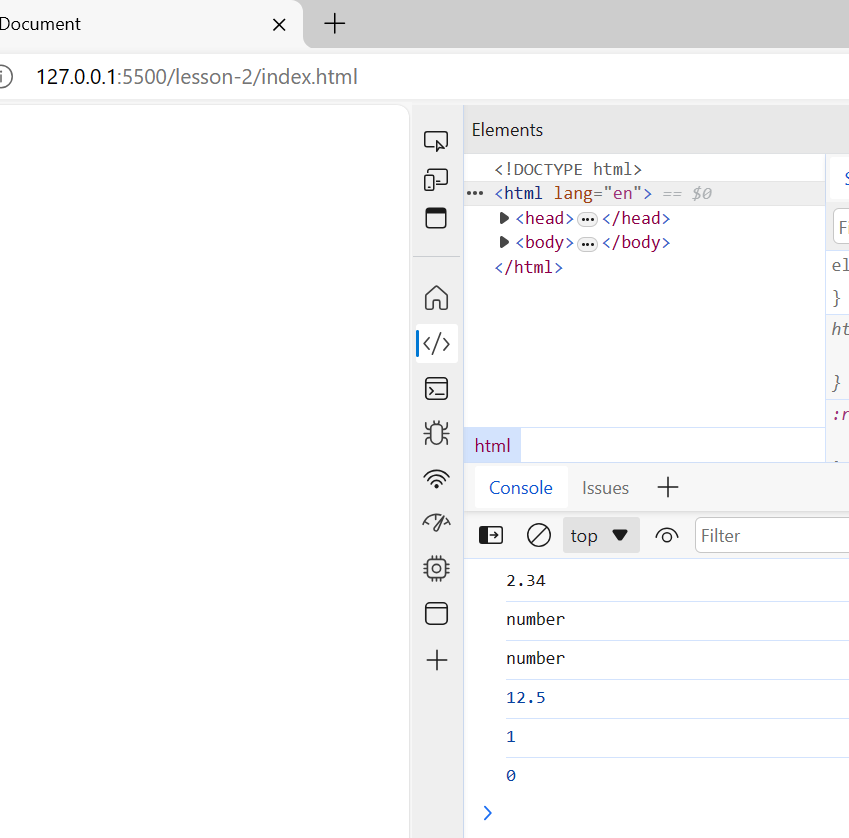
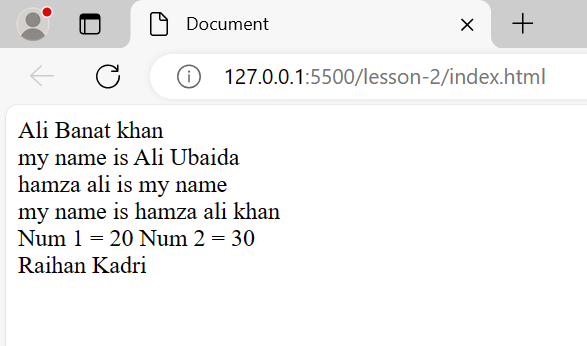
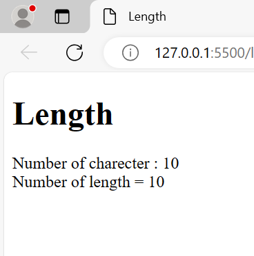
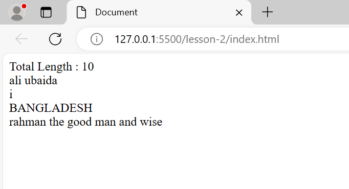
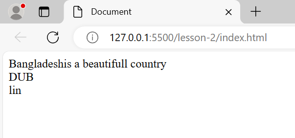
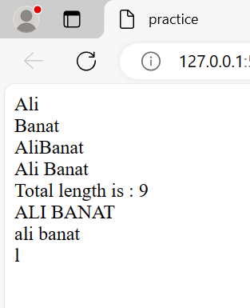
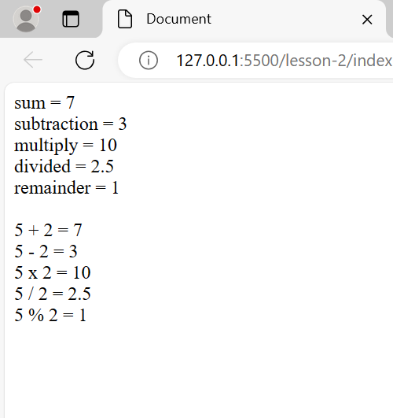

__J__~~av~~_a_ `script`
---

<ol>
<li> alert(); [alert]
<li> document.write(); [write to print]
<li> console.log(); [inspect>console on browser]
<li> 
</ol>

### write java script in browser

inspect > sources > page more option button > snippets > New Snippets > write program name > Type code > console.log("inside the console log"); > ctrl + enter > ok.

### add java script in HTML

### body

```html
<!DOCTYPE html>
<html lang="en">
<head>
    <meta charset="UTF-8">
    <meta name="viewport" content="width=device-width, initial-scale=1.0">
    <title>Add Java Script HTML</title>
</head>
<body onload="alert('Hello');">
</body>
</html>
```

### head

```html
<!DOCTYPE html>
<html lang="en">
<head>
    <meta charset="UTF-8">
    <meta name="viewport" content="width=device-width, initial-scale=1.0">
    <title>Add Java Script HTML</title>
    <script>
        alert("Hello");
    </script>
</head>
</body>
</html>
```
### end of the body

```html
<!DOCTYPE html>
<html lang="en">
<head>
    <meta charset="UTF-8">
    <meta name="viewport" content="width=device-width, initial-scale=1.0">
    <title>Add Java Script HTML</title>
</head>
<body>
    <h1></h1>
    <p></p>
    <div></div>
    <script>
        alert("Hello");
    </script>
</body>
</html>
```

### external java script add html

```html
<!DOCTYPE html>
<html lang="en">
<head>
    <meta charset="UTF-8">
    <meta name="viewport" content="width=device-width, initial-scale=1.0">
    <title>Add Java Script HTML</title>
</head>
<body>
    <h1></h1>
    <p></p>
    <div></div>
    <script src="index.js"></script>
    <script src="index1.js"></script>
</body>
</html>
```
```js
alert("ali banat");
```

### keyword data type & comment

*data type

open live server > inspect > console > typeof("Ali Banat");=string > typeof(1234);=number > typeof(true);=bulean > ok

*comment

* // single line
*   /* </br> 
    DOUBLE </br>
     LINE </br> 
    */

*use string for </br> tag

    `document.write("ali</br>");`

### declare variable

```html
<!DOCTYPE html>
<html lang="en">
<head>
    <meta charset="UTF-8">
    <meta name="viewport" content="width=device-width, initial-scale=1.0">
    <title>Document</title>
</head>
<body>
    <script>
        var name,age,id;
        name="ali banat</br>";
        age= "24</br>";
        id=18102041;
        document.write(name);
        document.write(age);
        document.write(id);
    </script>
</body>
</html>
```
### number method

```html
<!DOCTYPE html>
<html lang="en">
<head>
    <meta charset="UTF-8">
    <meta name="viewport" content="width=device-width, initial-scale=1.0">
    <title>Document</title>
</head>
<body>
    <script>
        var id=18102054;
        console.log(typeof(id));
        id=toString(id);
        console.log(typeof(id));
        id=parseInt(id);
        console.log(typeof(id));
        id="22.5";
        console.log(typeof(id));
        id = parseFloat(id);
        console.log(typeof(id));
    </script>
</body>
</html>
```
### round figure or 1/2/3/as you wish after do.t ".toFix();"

```css
var num=13.5434;

console.log(num.toFixed());
```

*answer will ber 14 round figure. </br>

if the num is 13.40 less than half then it would be </br>

*answer will be 13 round figure.

```js
var num=13.49;

console.log(num.toFixed(2));
```


### include integer number roundfigure to show number i want

```js
var number=2.34234;

console.log(number.toPrecision(3));
```


### number

```js
var num=2.34234;

console.log(num.toPrecision(3));

console.log(typeof(Number("123")));
console.log(typeof(Number("12.55")));

console.log(Number("     12.5       "));

console.log(Number(true));
console.log(Number(false));
```


### concatenate

`document.write("ali"+" banat" + " khan");`

```html
<!DOCTYPE html>
<html lang="en">
<head>
    <meta charset="UTF-8">
    <meta name="viewport" content="width=device-width, initial-scale=1.0">
    <title>Document</title>
</head>
<body>
    <script>
        document.write("Ali"+" Banat" + " khan</br>");
        var firstName="Ali",lastName=" Ubaida</br>";
        var fullName=firstName+lastName;
        document.write("my name is "+fullName);
        var fullName="hamza ali";
        document.write(fullName+" is my name</br>");

        document.write("my name is "+fullName+" khan</br>");
        var num1= 20,num2="30 </br>";
        document.write("Num 1 = "+num1 + " Num 2 = "+num2);
        var name="Raihan Kadri";
        document.write(name);
    </script>
</body>
</html>
```


### length

```html
<script>
    var name="ahasan khan"
    var len=name.length;
    document.write("The total number of text is : "+len+"</br>");
    document.write("Total length of text is : "+name.length);
</srcript>
```
```html
<!DOCTYPE html>
<html lang="en">
<head>
    <meta charset="UTF-8">
    <meta name="viewport" content="width=device-width, initial-scale=1.0">
    <title>Length</title>
</head>
<body>
    <h1> Length </h1>
    <script>
        var name="rahman ali";
       var len= name.length;
       document.write("Number of charecter : "+len+"</br>");
       document.write("Number of length = "+ name.length);
    </script>
</body>
</html>
```


### input name print length using "prompt"+UpperCase+LowerCase+input+selctspecific

```html
<!DOCTYPE html>
<html lang="en">
<head>
    <meta charset="UTF-8">
    <meta name="viewport" content="width=device-width, initial-scale=1.0">
    <title>Document</title>
</head>
<body>
    <script>
        var name=prompt("Enter your name : ");
        document.write("Total Length : "+name.length+"</br>");
        document.write(name+"</br>");
        var name="ali jafar";
        document.write(name.charAt(2)+"</br>");

        var country = "banglaDESH";
        country=country.toUpperCase();
        document.write(country+"</br>");
        var count = "rahman the good man and wise",ali = "DUblin";
        var cunt=count.toLowerCase();
        document.write(cunt+"</br");
        document.write(ali);
    </script>
    
</body>
</html>
```

### adjust and cut words "concat" "slice"

```html
<!DOCTYPE html>
<html lang="en">
<head>
    <meta charset="UTF-8">
    <meta name="viewport" content="width=device-width, initial-scale=1.0">
    <title>Document</title>
</head>
<body>
    <script>
        var text1="Bangladesh";
        var text2="is a beautifull country</br>";
        document.write(text1.concat(text2));
        var text = "DUBlin</br>";
        var name= text.slice(0, 3);
        document.write(name+"</br>");
        var name1 = text.slice(3, 6);
        document.write(name1);
    </script>
</body>
</html>
```


### practice

```html
<!DOCTYPE html>
<html lang="en">
    <head>
        <meta charset="UTF-8">
        <title>practice</title>
    </head>
    <body>
        <script>
            var firstname=prompt("Enter first name : ");
            document.write(firstname+"</br>");
            var lastname=prompt("Enter the last name : ");
            document.write(lastname+"</br>");
            document.write(firstname.concat(lastname+"</br>"));
            document.write(firstname+" "+lastname+"</br>");
            var fullname=firstname+" "+lastname;
            document.write("Total length is : "+fullname.length+"</br>");
            document.write(fullname.toUpperCase());
            document.write("</br>")
            document.write(fullname.toLowerCase());
            document.write("</br>");
            document.write(fullname.charAt(1));
        </script>
    </body>
</html>
```


### practice

### arithmatic operator

<ol>
<li> +
<li> -
<li> /
<li> *
<li> ++
<li> --
<li> %
<li> **(power)
</ol>

### assignment operator

<ol>
<li> +=
<li> -=
<li> /=
<li> *=
<li> %=
<li> **=
</ol>

x +=6; x = x + 6; </br>
x -=6; x = x - 6; </br>

### integer a number

`name = parseInt(num1, 10);`

### Task 1

```html
<!DOCTYPE html>
<html lang="en">
<head>
    <meta charset="UTF-8">
    <meta name="viewport" content="width=device-width, initial-scale=1.0">
    <title>Document</title>
</head>
<body>
    <script>
        var num1=prompt("Enter the first number : ");
        var num2=prompt("Enter the second number : ");

        num1=parseInt(num1, 10);
        num2=parseInt(num2, 10);

        var sum,sub,mul,div,rem;

        sum=num1+num2;
        sub=num1-num2;
        mul=num1*num2;
        div=num1/num2;
        rem=num1%num2;
        
        document.write("sum = "+sum+"</br>");
        document.write("subtraction = "+sub+"</br>");
        document.write("multiply = "+mul+"</br>");
        document.write("divided = "+div+"</br>");
        document.write("remainder = "+rem+"</br></br>");

        document.write(num1 + " + " + num2 + " = " + sum + "</br>");
        document.write(num1 + " - " + num2 + " = " + sub + "</br>");
        document.write(num1 + " x " + num2 + " = " + mul + "</br>");
        document.write(num1 + " / " + num2 + " = " + div + "</br>");
        document.write(num1 + " % " + num2 + " = " + rem + "</br>");
    </script>
</body>
</html>
```


### area of square/reactangle Float

```html
    <script>
        var base = parseFloat(prompt("Enter Base : "));
        var height = parseFloat(prompt("Enter Height : "));

        var area = base * height;

        document.write("Area of Triangle = "+area);
    </script>
```
### integer

```html
    <script>
        var base = parseInt(prompt("Enter Base : "));
        var height = parseInt(prompt("Enter Height : "));

        var area = base * height;

        document.write("Area = "+area);
    </script>
```

### area of triangle

```html
    <script>
        var base = parseFloat(prompt("Enter Base : "));
        var height = parseFloat(prompt("Enter Height : "));

        var areaoftriangle = (base * height)/2;

        document.write("Area = "+areaoftriangle);
    </script>
```
### tempareture converter

### Fahrenheit to Celsius

```html
    <script>
        var fahrenheit = parseFloat(prompt("Enter the fahrenheit number : "));
        var celsius = (fahrenheit-32)*(5/9);
        document.write("celsius value is : "+celsius);
    </script>
```
### Celsius to Fahrenheit

```html
    <script>
        var celsius=parseFloat(prompt("Enter the celsius value : "));
        fahrenheit= (celsius*(9/5))+32;
        document.write("Fahrenheit : "+fahrenheit);
    </script>
```
### Relational Operator

* > , >= , < , <= , == , === , !== , !===

### Logical Operator

* && , || , !

### relational operator

== > check variable equal only ex. 20==20 true </br>
== > check varible equal only ex. 20=="20" true </br> 
=== > check variable and data type equal both ex. 20==="20" false </br>

`console.log(num1>num2 && num1>num3)`

`console.log(!(25<20));` true </br>
`console.log(!(25<29));` false </br>

### if else

```js
var num=prompt("Enter the number to find odd or even : ");
if(num%2==0)
    console.log("Even");

if(num%2!=0)
    console.log("odd");
```
```js
var num = prompt("Enter the number : ");

if(num%2==0)
    console.log("Even");
else
    console.log("Odd");
```
### Grading System javascript

```js
var marks = prompt("Enter Marks : ");

if(marks<33)
    {
    console.log("Fail");
    document.write("Letter Grade = F </br>")
    document.write("Grade Point = 0");
    }
else if(marks<40)
    {
        console.log("D");
        document.write("Letter Grade = D </br>");
        document.write("Grade Point = 1");
    }
else if(marks<50)
    {
        console.log("C");
        document.write("Letter Grade : C </br>");
        document.write("Grade Point = 2");
    }
else if(marks<60)
    {
        console.log("B");
        document.write("Letter Grade = B </br>");
        document.write("Grade Point = 3");
    }
else if(marks<70)
    {
        console.log("A-");
        document.write("Letter Grade = A- </br>");
        document.write("Grade Point = 3.5");
    }
else if(marks<80)
    {
        console.log("A");
        document.write("Letter Grade = A </br>")
        document.write("Grade Point = 4 ");
    }
else if(marks<=100)
    {
        console.log("A+");
        document.write("Letter Grade = A+ </br>");
        document.write("Grade Point = 5");
    }
    else
    {
        console.log("Error");
        document.write("incorrent number please give numbers 1 to 100");
    }
```
### positive negetive and zero

```js
var num = prompt("Enter number : ");

if(num<0)
    console.log("Negetive");
else if(num>0)
    console.log("Positive");
else
console.log("zero");
```

### using logical operator

```js
var marks = prompt("Enter Marks : ");

if(marks<=32 && marks>=0)
    {
    console.log("Fail");
    document.write("Letter Grade = F </br>")
    document.write("Grade Point = 0");
    }
else if(marks<=39 && marks>=33)
    {
        console.log("D");
        document.write("Letter Grade = D </br>");
        document.write("Grade Point = 1");
    }
else if(marks<49 && marks>=40)
    {
        console.log("C");
        document.write("Letter Grade : C </br>");
        document.write("Grade Point = 2");
    }
else if(marks<=59 && marks>=50)
    {
        console.log("B");
        document.write("Letter Grade = B </br>");
        document.write("Grade Point = 3");
    }
else if(marks<=69 && marks>=60)
    {
        console.log("A-");
        document.write("Letter Grade = A- </br>");
        document.write("Grade Point = 3.5");
    }
else if(marks<=79 && marks>=70)
    {
        console.log("A");
        document.write("Letter Grade = A </br>")
        document.write("Grade Point = 4 ");
    }
else if(marks<=100 && marks>=80)
    {
        console.log("A+");
        document.write("Letter Grade = A+ </br>");
        document.write("Grade Point = 5");
    }
    else
    {
        console.log("Error");
        document.write("incorrent number please give numbers 1 to 100");
    }
```
```js
    else if(marks<0 || marks>100)
    {
        console.log("Error");
        document.write("incorrent number please give numbers 1 to 100");
    }
```

### Maximum number

```js
//maximum number from three value

var num1 = prompt("Enter number one : ");
var num2 = prompt("Enter number two : ");
var num3 = prompt("Enter number three : ");
var num4 = prompt("Enter number four : ");

if (num1>num2 && num1>num3 && num1>num4)
    {
        console.log("number "+num1);
        document.write("maximum is "+num1+" number ");
    }
else if(num2>num1 && num2>num3 && num2>num4)
    {
        console.log("number "+num2);
        document.write("maximum is "+num2+" number ");
    }
else if(num3>num1 && num3>num2 && num3>num4)
    {
        console.log("number "+num3);
        document.write("maximum is "+num3+" number ");
    }
    else
    {
        console.log("number "+num4);
        document.write("maximum numbre is : "+ num4);
    }
```
### Vowel Consonent

```js
// write a javaScript programme that print vowel or consonent
var alphabet = prompt("Enter alphabet : ");

//alphabet = alphabet.toLowerCase(); 

if(alphabet=='a' || alphabet=='e'|| alphabet=='i'|| alphabet=='o'|| alphabet=='u' ||
alphabet=='A' || alphabet=='E'|| alphabet=='I'|| alphabet=='O'|| alphabet=='U')
    {
        console.log("vowel");
        document.write("vowel");
    }

    else
    {
        console.log("consonent");
        document.write("consonent");
    }
```