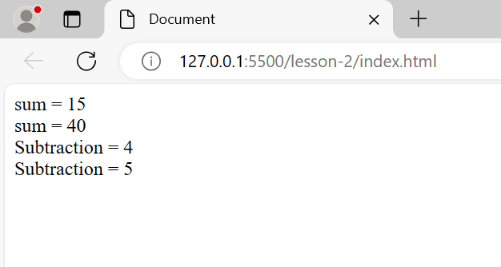
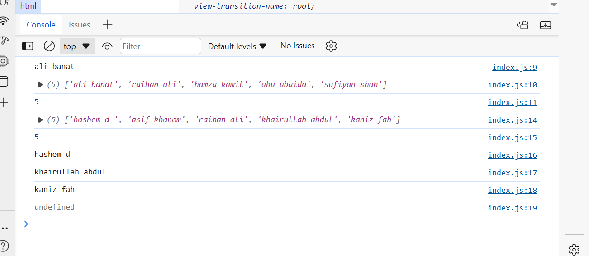
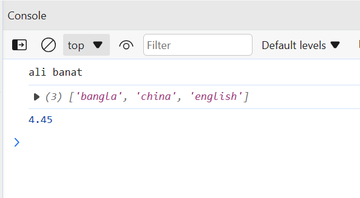
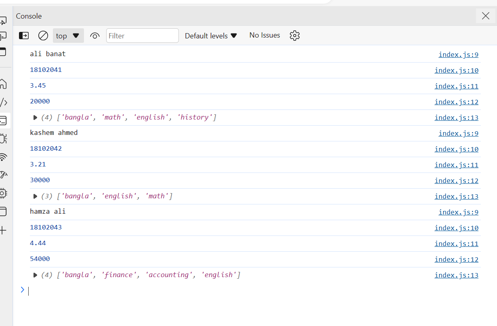
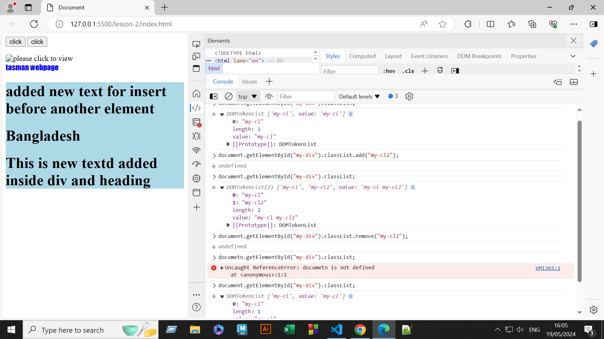
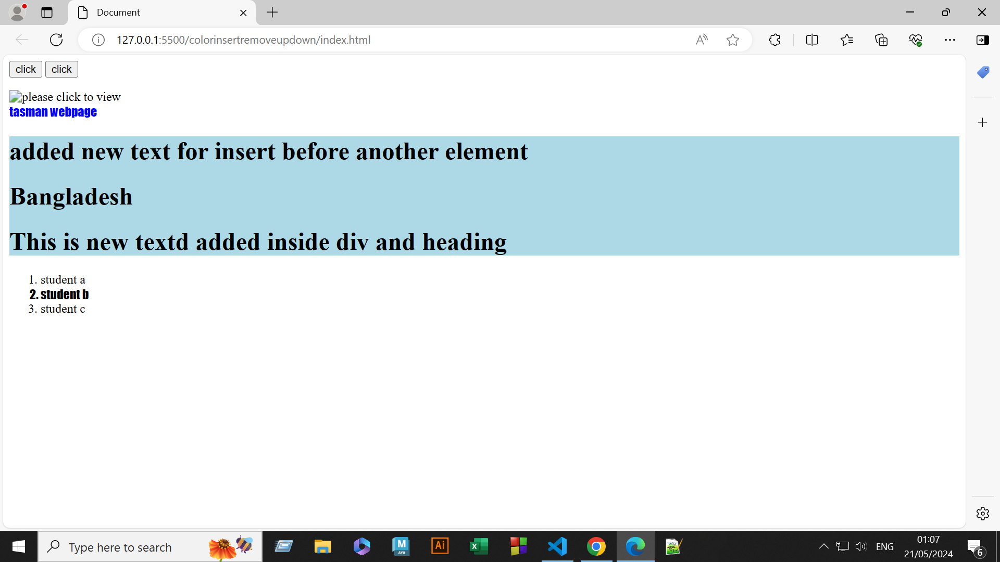

__J__~~av~~_a_ `script`
---

<ol>
<li> alert(); [alert]
<li> document.write(); [write to print]
<li> console.log(); [inspect>console on browser]
<li> 
</ol>

### write java script in browser

inspect > sources > page more option button > snippets > New Snippets > write program name > Type code > console.log("inside the console log"); > ctrl + enter > ok.

### add java script in HTML

### body

```html
<!DOCTYPE html>
<html lang="en">
<head>
    <meta charset="UTF-8">
    <meta name="viewport" content="width=device-width, initial-scale=1.0">
    <title>Add Java Script HTML</title>
</head>
<body onload="alert('Hello');">
</body>
</html>
```

### head

```html
<!DOCTYPE html>
<html lang="en">
<head>
    <meta charset="UTF-8">
    <meta name="viewport" content="width=device-width, initial-scale=1.0">
    <title>Add Java Script HTML</title>
    <script>
        alert("Hello");
    </script>
</head>
</body>
</html>
```
### end of the body

```html
<!DOCTYPE html>
<html lang="en">
<head>
    <meta charset="UTF-8">
    <meta name="viewport" content="width=device-width, initial-scale=1.0">
    <title>Add Java Script HTML</title>
</head>
<body>
    <h1></h1>
    <p></p>
    <div></div>
    <script>
        alert("Hello");
    </script>
</body>
</html>
```

### external java script add html

```html
<!DOCTYPE html>
<html lang="en">
<head>
    <meta charset="UTF-8">
    <meta name="viewport" content="width=device-width, initial-scale=1.0">
    <title>Add Java Script HTML</title>
</head>
<body>
    <h1></h1>
    <p></p>
    <div></div>
    <script src="index.js"></script>
    <script src="index1.js"></script>
</body>
</html>
```
```js
alert("ali banat");
```

### keyword data type & comment

*data type

open live server > inspect > console > typeof("Ali Banat");=string > typeof(1234);=number > typeof(true);=bulean > ok

*comment

* // single line
*   /* </br> 
    DOUBLE </br>
     LINE </br> 
    */

*use string for </br> tag

    `document.write("ali</br>");`

### declare variable

```html
<!DOCTYPE html>
<html lang="en">
<head>
    <meta charset="UTF-8">
    <meta name="viewport" content="width=device-width, initial-scale=1.0">
    <title>Document</title>
</head>
<body>
    <script>
        var name,age,id;
        name="ali banat</br>";
        age= "24</br>";
        id=18102041;
        document.write(name);
        document.write(age);
        document.write(id);
    </script>
</body>
</html>
```
### number method

```html
<!DOCTYPE html>
<html lang="en">
<head>
    <meta charset="UTF-8">
    <meta name="viewport" content="width=device-width, initial-scale=1.0">
    <title>Document</title>
</head>
<body>
    <script>
        var id=18102054;
        console.log(typeof(id));
        id=toString(id);
        console.log(typeof(id));
        id=parseInt(id);
        console.log(typeof(id));
        id="22.5";
        console.log(typeof(id));
        id = parseFloat(id);
        console.log(typeof(id));
    </script>
</body>
</html>
```
### round figure or 1/2/3/as you wish after do.t ".toFix();"

```css
var num=13.5434;

console.log(num.toFixed());
```

*answer will ber 14 round figure. </br>

if the num is 13.40 less than half then it would be </br>

*answer will be 13 round figure.

```js
var num=13.49;

console.log(num.toFixed(2));
```


### include integer number roundfigure to show number i want

```js
var number=2.34234;

console.log(number.toPrecision(3));
```


### number

```js
var num=2.34234;

console.log(num.toPrecision(3));

console.log(typeof(Number("123")));
console.log(typeof(Number("12.55")));

console.log(Number("     12.5       "));

console.log(Number(true));
console.log(Number(false));
```


### concatenate

`document.write("ali"+" banat" + " khan");`

```html
<!DOCTYPE html>
<html lang="en">
<head>
    <meta charset="UTF-8">
    <meta name="viewport" content="width=device-width, initial-scale=1.0">
    <title>Document</title>
</head>
<body>
    <script>
        document.write("Ali"+" Banat" + " khan</br>");
        var firstName="Ali",lastName=" Ubaida</br>";
        var fullName=firstName+lastName;
        document.write("my name is "+fullName);
        var fullName="hamza ali";
        document.write(fullName+" is my name</br>");

        document.write("my name is "+fullName+" khan</br>");
        var num1= 20,num2="30 </br>";
        document.write("Num 1 = "+num1 + " Num 2 = "+num2);
        var name="Raihan Kadri";
        document.write(name);
    </script>
</body>
</html>
```


### length

```html
<script>
    var name="ahasan khan"
    var len=name.length;
    document.write("The total number of text is : "+len+"</br>");
    document.write("Total length of text is : "+name.length);
</srcript>
```
```html
<!DOCTYPE html>
<html lang="en">
<head>
    <meta charset="UTF-8">
    <meta name="viewport" content="width=device-width, initial-scale=1.0">
    <title>Length</title>
</head>
<body>
    <h1> Length </h1>
    <script>
        var name="rahman ali";
       var len= name.length;
       document.write("Number of charecter : "+len+"</br>");
       document.write("Number of length = "+ name.length);
    </script>
</body>
</html>
```


### input name print length using "prompt"+UpperCase+LowerCase+input+selctspecific

```html
<!DOCTYPE html>
<html lang="en">
<head>
    <meta charset="UTF-8">
    <meta name="viewport" content="width=device-width, initial-scale=1.0">
    <title>Document</title>
</head>
<body>
    <script>
        var name=prompt("Enter your name : ");
        document.write("Total Length : "+name.length+"</br>");
        document.write(name+"</br>");
        var name="ali jafar";
        document.write(name.charAt(2)+"</br>");

        var country = "banglaDESH";
        country=country.toUpperCase();
        document.write(country+"</br>");
        var count = "rahman the good man and wise",ali = "DUblin";
        var cunt=count.toLowerCase();
        document.write(cunt+"</br");
        document.write(ali);
    </script>
    
</body>
</html>
```

### adjust and cut words "concat" "slice"

```html
<!DOCTYPE html>
<html lang="en">
<head>
    <meta charset="UTF-8">
    <meta name="viewport" content="width=device-width, initial-scale=1.0">
    <title>Document</title>
</head>
<body>
    <script>
        var text1="Bangladesh";
        var text2="is a beautifull country</br>";
        document.write(text1.concat(text2));
        var text = "DUBlin</br>";
        var name= text.slice(0, 3);
        document.write(name+"</br>");
        var name1 = text.slice(3, 6);
        document.write(name1);
    </script>
</body>
</html>
```


### practice

```html
<!DOCTYPE html>
<html lang="en">
    <head>
        <meta charset="UTF-8">
        <title>practice</title>
    </head>
    <body>
        <script>
            var firstname=prompt("Enter first name : ");
            document.write(firstname+"</br>");
            var lastname=prompt("Enter the last name : ");
            document.write(lastname+"</br>");
            document.write(firstname.concat(lastname+"</br>"));
            document.write(firstname+" "+lastname+"</br>");
            var fullname=firstname+" "+lastname;
            document.write("Total length is : "+fullname.length+"</br>");
            document.write(fullname.toUpperCase());
            document.write("</br>")
            document.write(fullname.toLowerCase());
            document.write("</br>");
            document.write(fullname.charAt(1));
        </script>
    </body>
</html>
```


### practice

### arithmatic operator

<ol>
<li> +
<li> -
<li> /
<li> *
<li> ++
<li> --
<li> %
<li> **(power)
</ol>

### assignment operator

<ol>
<li> +=
<li> -=
<li> /=
<li> *=
<li> %=
<li> **=
</ol>

x +=6; x = x + 6; </br>
x -=6; x = x - 6; </br>

### integer a number

`name = parseInt(num1, 10);`

### Task 1

```html
<!DOCTYPE html>
<html lang="en">
<head>
    <meta charset="UTF-8">
    <meta name="viewport" content="width=device-width, initial-scale=1.0">
    <title>Document</title>
</head>
<body>
    <script>
        var num1=prompt("Enter the first number : ");
        var num2=prompt("Enter the second number : ");

        num1=parseInt(num1, 10);
        num2=parseInt(num2, 10);

        var sum,sub,mul,div,rem;

        sum=num1+num2;
        sub=num1-num2;
        mul=num1*num2;
        div=num1/num2;
        rem=num1%num2;
        
        document.write("sum = "+sum+"</br>");
        document.write("subtraction = "+sub+"</br>");
        document.write("multiply = "+mul+"</br>");
        document.write("divided = "+div+"</br>");
        document.write("remainder = "+rem+"</br></br>");

        document.write(num1 + " + " + num2 + " = " + sum + "</br>");
        document.write(num1 + " - " + num2 + " = " + sub + "</br>");
        document.write(num1 + " x " + num2 + " = " + mul + "</br>");
        document.write(num1 + " / " + num2 + " = " + div + "</br>");
        document.write(num1 + " % " + num2 + " = " + rem + "</br>");
    </script>
</body>
</html>
```


### area of square/reactangle Float

```html
    <script>
        var base = parseFloat(prompt("Enter Base : "));
        var height = parseFloat(prompt("Enter Height : "));

        var area = base * height;

        document.write("Area of Triangle = "+area);
    </script>
```
### integer

```html
    <script>
        var base = parseInt(prompt("Enter Base : "));
        var height = parseInt(prompt("Enter Height : "));

        var area = base * height;

        document.write("Area = "+area);
    </script>
```

### area of triangle

```html
    <script>
        var base = parseFloat(prompt("Enter Base : "));
        var height = parseFloat(prompt("Enter Height : "));

        var areaoftriangle = (base * height)/2;

        document.write("Area = "+areaoftriangle);
    </script>
```
### tempareture converter

### Fahrenheit to Celsius

```html
    <script>
        var fahrenheit = parseFloat(prompt("Enter the fahrenheit number : "));
        var celsius = (fahrenheit-32)*(5/9);
        document.write("celsius value is : "+celsius);
    </script>
```
### Celsius to Fahrenheit

```html
    <script>
        var celsius=parseFloat(prompt("Enter the celsius value : "));
        fahrenheit= (celsius*(9/5))+32;
        document.write("Fahrenheit : "+fahrenheit);
    </script>
```
### Relational Operator

* > , >= , < , <= , == , === , !== , !===

### Logical Operator

* && , || , !

### relational operator

== > check variable equal only ex. 20==20 true </br>
== > check varible equal only ex. 20=="20" true </br> 
=== > check variable and data type equal both ex. 20==="20" false </br>

`console.log(num1>num2 && num1>num3)`

`console.log(!(25<20));` true </br>
`console.log(!(25<29));` false </br>

### if else

```js
var num=prompt("Enter the number to find odd or even : ");
if(num%2==0)
    console.log("Even");

if(num%2!=0)
    console.log("odd");
```
```js
var num = prompt("Enter the number : ");

if(num%2==0)
    console.log("Even");
else
    console.log("Odd");
```
### Grading System javascript

```js
var marks = prompt("Enter Marks : ");

if(marks<33)
    {
    console.log("Fail");
    document.write("Letter Grade = F </br>")
    document.write("Grade Point = 0");
    }
else if(marks<40)
    {
        console.log("D");
        document.write("Letter Grade = D </br>");
        document.write("Grade Point = 1");
    }
else if(marks<50)
    {
        console.log("C");
        document.write("Letter Grade : C </br>");
        document.write("Grade Point = 2");
    }
else if(marks<60)
    {
        console.log("B");
        document.write("Letter Grade = B </br>");
        document.write("Grade Point = 3");
    }
else if(marks<70)
    {
        console.log("A-");
        document.write("Letter Grade = A- </br>");
        document.write("Grade Point = 3.5");
    }
else if(marks<80)
    {
        console.log("A");
        document.write("Letter Grade = A </br>")
        document.write("Grade Point = 4 ");
    }
else if(marks<=100)
    {
        console.log("A+");
        document.write("Letter Grade = A+ </br>");
        document.write("Grade Point = 5");
    }
    else
    {
        console.log("Error");
        document.write("incorrent number please give numbers 1 to 100");
    }
```
### positive negetive and zero

```js
var num = prompt("Enter number : ");

if(num<0)
    console.log("Negetive");
else if(num>0)
    console.log("Positive");
else
console.log("zero");
```

### using logical operator

```js
var marks = prompt("Enter Marks : ");

if(marks<=32 && marks>=0)
    {
    console.log("Fail");
    document.write("Letter Grade = F </br>")
    document.write("Grade Point = 0");
    }
else if(marks<=39 && marks>=33)
    {
        console.log("D");
        document.write("Letter Grade = D </br>");
        document.write("Grade Point = 1");
    }
else if(marks<49 && marks>=40)
    {
        console.log("C");
        document.write("Letter Grade : C </br>");
        document.write("Grade Point = 2");
    }
else if(marks<=59 && marks>=50)
    {
        console.log("B");
        document.write("Letter Grade = B </br>");
        document.write("Grade Point = 3");
    }
else if(marks<=69 && marks>=60)
    {
        console.log("A-");
        document.write("Letter Grade = A- </br>");
        document.write("Grade Point = 3.5");
    }
else if(marks<=79 && marks>=70)
    {
        console.log("A");
        document.write("Letter Grade = A </br>")
        document.write("Grade Point = 4 ");
    }
else if(marks<=100 && marks>=80)
    {
        console.log("A+");
        document.write("Letter Grade = A+ </br>");
        document.write("Grade Point = 5");
    }
    else
    {
        console.log("Error");
        document.write("incorrent number please give numbers 1 to 100");
    }
```
```js
    else if(marks<0 || marks>100)
    {
        console.log("Error");
        document.write("incorrent number please give numbers 1 to 100");
    }
```

### Maximum number

```js
//maximum number from three value

var num1 = prompt("Enter number one : ");
var num2 = prompt("Enter number two : ");
var num3 = prompt("Enter number three : ");
var num4 = prompt("Enter number four : ");

if (num1>num2 && num1>num3 && num1>num4)
    {
        console.log("number "+num1);
        document.write("maximum is "+num1+" number ");
    }
else if(num2>num1 && num2>num3 && num2>num4)
    {
        console.log("number "+num2);
        document.write("maximum is "+num2+" number ");
    }
else if(num3>num1 && num3>num2 && num3>num4)
    {
        console.log("number "+num3);
        document.write("maximum is "+num3+" number ");
    }
    else
    {
        console.log("number "+num4);
        document.write("maximum numbre is : "+ num4);
    }
```
### Vowel Consonent

```js
// write a javaScript programme that print vowel or consonent
var alphabet = prompt("Enter alphabet : ");

//alphabet = alphabet.toLowerCase(); 

if(alphabet=='a' || alphabet=='e'|| alphabet=='i'|| alphabet=='o'|| alphabet=='u' ||
alphabet=='A' || alphabet=='E'|| alphabet=='I'|| alphabet=='O'|| alphabet=='U')
    {
        console.log("vowel");
        document.write("vowel");
    }

    else
    {
        console.log("consonent");
        document.write("consonent");
    }
```

### number to text 1 to 9

```js
//write a programme that print number to word
var num = prompt("Enter a number : ");

if(num==0)
    {
        console.log("zero");
        document.write("zero");
    }
else if(num==1)
    {
        console.log("One");
        document.write("One");
    }
else if(num==2)
            {
                console.log("Two");
                document.write("Two");
            }
else if(num==3)
                {
                    console.log("Three");
                    document.write("Thhree");
                }
else if(num==4)
                    {
                        console.log("Four");
                        document.write("Four");
                    }
else if(num==5)
                        {
                            console.log("Five");
                            document.write("Five");
                        }
else if(num==6)
                            {
                                console.log("Six");
                                document.write("Six");
                            }
else if(num==7)
                                {
                                    console.log("seven");
                                    document.write("Seven");
                                }
else if(num==8)
                                    {
                                        console.log("Eight");
                                        document.write("Eight");
                                    }
else if(num==9)
                                        {
                                            console.log("Nine");
                                            document.write("Nine");
                                        }
else
                                        {
                                            console.log("Error");
                                            document.write("The number is invalid");
```
### number to word using switch

```js
// write a programme that print number to words 1 to 9 using switch
var num = prompt("Enter the number : ");

switch(num){
    case '0':
        console.log("Zero");
        document.write("Zero");
    case '1':
        console.log("One");
        document.write("One");
    case '2':
        console.log("Two");
        document.write("Two");
    case '3':
        console.log("Three");
        document.write("Three");

    case '4':
        console.log("Four");
        document.write("Four");
        break;
    case '5':
        console.log("Five");
        document.write("Five");
        break;
    case '6':
        console.log("Six");
        document.write("Six");
        break;
    case '7':
        console.log("Seven");
        document.write("Seven");
        break;
    case '8':
        console.log("Eight");
        document.write("Eight");
        break;
    case '9':
        console.log("Nine");
        document.write("Nine");
        break;
    default:
    console.log("invalid");
    document.write("Invalid");
    break;
}
```
### vowel using switch

```js
// input a letter to check that is vowel or consonant

var letter = prompt("Enter a letter : ");

letter = letter.toLowerCase();
switch(letter){
    case 'a':
        console.log("vowel");
        document.write("vowel");
        break;
    case 'e':
        console.log("vowel");
        document.write("vowel");
        break;
    case 'i':
        console.log("vowel");
        document.write("vowel");
        break;
    case 'o':
        console.log("vowel");
        document.write("vowel");
        break;
    case 'u':
        console.log("vowel");
        document.write("vowel");
        break;
    default:
        console.log("consonant");
        document.write("consonant");
        break;
}
```
### alternative

```js
// alternative vowel consonant using switch

var letter = prompt("Enter the letter : ");

letter = letter.toLowerCase();

switch(letter){
    case 'a':
    case 'e':
    case 'i':
    case 'o':
    case 'u':
        console.log("Vowel");
        document.write("Vowel");
        break;
    default:
        console.log("Consonant");
        document.write("Consonant");
        break;
}
```
### for loop

```js
// write a programme that print using loop

for(var x=1; x<=5; x++)
    {
        document.write("<h1>Bangladesh</h1>");
    }
```
### odd number

```js
// enter a number that print odd number;

var len = prompt("Enter the number till : ");

for(var i=1; i<=len; i++)
    {
        if(i%2!=0)
            {
                document.write(i+" ");
            }
    }
```
### addition
```js
var sum = 0;
var m = parseInt(prompt("Enter starting number : "));
var n = parseInt(prompt("Enter ending number : "));


for(var i=m; i<=n; i++)
    {
        sum=sum+i;
        document.write(i+" + ")
    }
    console.log(sum);
    document.write("</br> Total = "+ sum);
```
### while loop
```js
var i= 1;
while(i<=100)
{
    document.write(i+" ");
    i++;
}
```
### do while loop

```js
var num = 1;
do{
    document.write(num+" ");
    num++;
}while(num<=10);
```
### continue

```js
for(var i=0; i<=100; i++)
    {
        if(i%2==0)
            {
                continue;
            }
            console.log(i);
            document.write(i+ " ");
    }
```

var number = Number(prompt("Enter number : "));

`number > 0 ? console.log("Positive") : console.log("Negetive");`

if number > 0 ? yes : no ;

### similar

var number = Number(prompt("Enter number : "));

`number > 0 ? document.write("Positive") : number<0 ? document.write("Negetive") : document.write("Zero");`

### Function

```js
function square(num){

result = num * num;
document.write(result+"</br>");
}
square(5);
square(2);
square(3);
```
### function

```js
function sum(num1, num2){
    result = num1 + num2;
    document.write(result+"</br>");
}
sum(5,6);
sum(3,2);
```
### similar
```js
function sum(num1, num2){
    result = num1+num2;
    return result;
}
document.write(sum(5,6));
```
### alternative

```js
function sum(num1, num2){
    result = num1+num2;
    return result;
}

var n = sum(3,9);
document.write(n);
```
```js
function addition(num1,num2){
    result = num1+num2;
    document.write("sum = "+result+"</br>");
}
addition(5,10);
addition(10,30);

function subtraction(num1,num2)
{
    result = num1 - num2;
    document.write("Subtraction = "+result+"</br>");
}
subtraction(7,3);
subtraction(10,5);
```


## IIFEs

```js
(function addition(num1, num2){
    var num1 = 2,num2 =3 ;
    result = num1 + num2;
    document.write(result+"</br>");
})();

(function subtraction(a ,b){

    result = a - b;
    document.write(result+"</br>");
})(2,3);
```
### array
```js
var names = new Array();

names[0]="ali banat";
names[1]="raihan ali";
names[2]="hamza kamil";
names[3]="abu ubaida";
names[4]="sufiyan shah";

console.log(names[0]);
console.log(names);
console.log(names.length);

var dua = ["hashem d ","asif khanom","raihan ali","khairullah abdul","kaniz fah"]
console.log(dua);
console.log(dua.length);
console.log(dua[0]);
console.log(dua[3]);
console.log(dua[4]);
console.log(dua[5]);
```


### push and pop

* name.push = add a name in the last
* name.pop = delete last name

```js
var names = new Array();

names[0]="ali banat";
names[1]="raihan ali";
names[2]="hamza kamil";
names[3]="abu ubaida";
names[4]="sufiyan shah";

console.log(names[0]);
console.log(names);
console.log(names.length);

var dua = ["hashem d ","asif khanom","raihan ali","khairullah abdul","kaniz fah"]
console.log(dua);
console.log(dua.length);
console.log(dua[0]);
console.log(dua[3]);
console.log(dua[4]);
console.log(dua[5]);
dua.push("dipraaz sareng");
console.log(dua[5]);
console.log(dua.length);
dua.push("kamal khan");
dua.push("rahim karim");
console.log(dua.length);
console.log(dua);
dua.pop();
console.log(dua);
dua.pop();
console.log(dua);
```


### concat attached two array 

```js
var country1 = ["bangladesh", "nepal"];
var country2 = ["india", "pakistan"];
var both = country1.concat(country2);

console.log(both);

console.log(both[0]);
console.log(both[1]);
console.log(both[2]);
console.log(both[3]);
```


### array loop

```js
var num = new Array();

for(var j=0; j<=6; j++)
    {
        num[j] = prompt("Enter a number : ");
    }
for(var i=0; i<=6; i++)
    {
        console.log(num[i]);
    }
```
### sum using for loop array

```js
var num = new Array();
var sum = 0;

for(var j=0; j<=6; j++)
    {
        num[j] = parseInt(prompt("Enter a number : "));
    }
for(var i=0; i<=6; i++)
    {
        sum = sum + num[i];
        console.log(num[i]+" + ");
    }
    console.log(sum);
```
### 

* name.push = enter new entry
* name.pop = remove last entry
* name.shift = remove first entry
* name.unshift = new entry first
* name.splice(2,3,"ali","tayef","rafa") = add multiple entry in specific place(here number 2 position) and remove input from first (here 3 means first 3 entry will be removed)
* name.splice(1,2) = position 1 and 2 will romove.
*  alter= name.slice(1) = main name data will be same but new "alter" will change. 1 to first one remove multiple number to multi remove.
* name.sort = sorting serial wise only alphabet
* name.reverse = reverse of sorting 
* var num = [5,54,30,1,6];
num.sort(function(a,b){
    return a-b;
});
console.log(num); = serialwise number
* b-a in return to = reverse number


### tag

```js
var names = ["ali banat","raihan khilji","bukhtiar ali"];
console.log(names);
names.push("hyder ali");
console.log(names);
console.log(names.length);
names.pop();
console.log(names);
names.shift();
console.log(names);
names.unshift("romiuzudding ahmed");
console.log(names);
names.splice(2,0,"sidiqqe sahab","borkot ali","abu hanifa","samir b","karin ","ramp ratul");
console.log(names);
names.splice(0,1);
console.log(names);
names.splice(1,2);
console.log(names);
var alter = names.slice(2);
console.log(alter);
console.log(names);
names.sort();
console.log(names);
names.reverse();
console.log(names);

var num = [1,20,25,45,5];

num.sort(function(a,b){
    return a-b;
});
console.log(num);
```
### maximum number using array,function,loop
```js
function high(num){

    for(var j=0; j<=3; j++)
        {
            console.log(num[j]);
            document.write("number = "+num[j]+"</br>");
        }


var highscore = num[0];

for(var i=0; i<=3; i++)
    {
        if(num[i]>highscore)
            {
                highscore=number[i];
            }
    }
    console.log(highscore);
    document.write("High Score : "+highscore);
}
let num = new Array();
for(var i=0; i<=3; i++)
    {
        num[i] = prompt("Enter the number "+(i+1)+": ");
    }

high(num);
```
```js
console.clear();

function highScore(num){
    var max = num[0];
    for(var i=0; i<num.length; i++)
        {
            if(num[i]>max)

                {
                    max = num[i];
                }
        }
        return max;
}

var num = [10,20,33,44,50,999];
var maxScore = highScore(num);
console.log(maxScore);
```
### function array 2D

```js
console.clear();
function highestRunScorer(playersInfo){
    console.log(playersInfo);
    var highestScorer = playersInfo[0][0];
    console.log(highestScorer);
    var highestScore = playersInfo[0][1];
    console.log(highestScore);
    console.log(playersInfo.length);
    for( var x = 0; x<playersInfo.length; x++)
        {
            if(highestScore<playersInfo[x][1])
                {
                    highestScore = playersInfo[x][1];
                    console.log(highestScore);
                    highestScorer = playersInfo[x][0];
                    console.log(highestScorer);
                }
        }
        return highestScorer;
}
var playersInfo = [
["riham b",10],
["ali banat",30],
["khairullah",22],
["abu ubaida",33],
];
var name = highestRunScorer(playersInfo);
console.log(name);
document.write(name);
```
### similar
```js
var list = [
    ["ali b",20],
    ["safa t",10],
    ["ruquaya m",333],
    ["kashe briges",44]
];
var name = biodata(list);
console.log(name);
function biodata(list){
    var maxer = list[0][0];
    var max = list[0][1];
    for(var x=0; x<list.length; x++)
        {
            if(max<list[x][1])
                {
                    max = list[x][1];
                    maxer = list[x][0];
                }
        }
        return maxer;
}
```

### create and use object

```js
var student1 = {
    name : "ali banat",
    age : 25,
    cgpa : 2.71,
    language : ["bangla","english"]
}
console.log(student1.name);
```
### not a shortcut

```js
var student1 = {
    name : "ali banat",
    age : 25,
    cgpa : 2.71,
    language : ["bangla","english"]
}

var student2 = {
    name : "hamza ali",
    age : 24,
    cgpa : 2.71,
    language : ["bangla","china","english"]
}


var student3 ={
    name : "kawsar",
    age : 30,
    cgpa : 2.55,
    language : ["bangla","japaneese","english"]
}
```
### shortcut

```js
function Student(name,age,cgpa,lang){

    this.name = name;
    this.age = age;
    this.cgpa = cgpa;
    this.lang = lang;
}

var student1 = new Student("ali banat",32,2.75,["bangla","english"]);
var student2 = new Student("raihan ahmed",25,3.21,["bangla","china","english"]);
var student3 = new Student("Hamza ali",53,4.45,["english","japaneese"]);

console.log(student1.name);
console.log(student2.lang);
console.log(student3.cgpa);
```


### more shortcut and print

```js
function Student(name,age,cgpa,lang){

    this.name = name;
    this.age = age;
    this.cgpa = cgpa;
    this.lang = lang;

    this.display = function(){
        console.log(this.name);
        console.log(this.age);
        console.log(this.cgpa);
        console.log(this.lang);
    }
}

var student1 = new Student("ali banat",32,2.75,["bangla","english"]);
var student2 = new Student("raihan ahmed",25,3.21,["bangla","china","english"]);
var student3 = new Student("Hamza ali",53,4.45,["english","japaneese"]);

student1.display();
student2.display();
student3.display();
```
### similar

```js
function bio(name,id,gpa,salary,sub){
    this.name = name;
    this.id = id;
    this.gpa = gpa;
    this.salary = salary;
    this.sub = sub;

    this.display = function(){
        console.log(this.name);
        console.log(this.id);
        console.log(this.gpa);
        console.log(this.salary);
        console.log(this.sub);
    }
}

var student1 = new bio("ali banat",18102041,3.45,20000,["bangla","math","english","history"]);
var student2 = new bio("kashem ahmed",18102042,3.21,30000,["bangla","english","math"]);
var student3 = new bio("hamza ali",18102043,4.44,54000,["bangla","finance","accounting","english"]);

student1.display();
student2.display();
student3.display();
```


### guessing game

```js
var win = 0;
var lost = 0;
for(var i=1; i<=5; i++)
    {
        var guess = parseInt(prompt("Enter the number 1 to 5 : "));
        var rand = Math.floor(Math.random()*5+1);
        if(guess==rand)
            {
                console.log("you have won");
                win++;
            }
            else
            {
                lost++;
                console.log("you have lost . random number was : "+rand);
            }
    }
    console.log("Win : "+win+" Times and Lost : "+lost+" Times");
```

### math

<ol>
<li> Math.sqrt(25); = 5
<li> Math.abs(-5); = 5
<li> Math.sin(2); = 0.909
<li> Math.floor(4.6); = 4
<li> Math.ceil(4.4); = 5
<li> Math.round(4.4); = 4
<li> Math.round(4.5); = 5
<li> Math.pow(2,3); = 8
<li> Math.max(2,3,-5); = 3
<li> Math.random();
<li> Math.floor(Math.random()* 5); 0 to 4 random digit
<li> Math.floor(Math.random()* 5)+1; 0+1 = 1 to 5 digit
<li> Math.floor(Math.random()* 11)+10; 10 to 20 random digit;
</ol>

### simple maximum math

```js
var num1 = parseInt(prompt("Enter number one : "));
var num2 = parseInt(prompt("Enter number two : "));

var maximum = Math.max(num1,num2);
console.log(maximum);
```

### Date

```js
var date = new Date();
console.log(date);
var year = date.getFullYear();
console.log(year);
var currentDate = date.getDate();
console.log(currentDate);
var month = date.getMonth();
console.log(month);
var day = date.getDay();
console.log(day);
var hours = date.getHours();
console.log(hours);
var minutes = date.getMinutes();
console.log(minutes);
var seconds = date.getSeconds();
console.log(seconds);
```
### document object model (DOM)

### get element by id

`document.getElementById("heading1").innerHTML = "Changed the text";`

```js
var change = document.getElementById("heading1")

change.innerHTML = "hello world!";

document.getElementById("paragraph1").innerHTML = "abu ubaida";
var para2 = document.getElementById("heading2");
para2.innerHTML = "good bye";
document.getElementById("heading3").innerHTML = "Good bye";
```
### get elements by tag name

`documetn.getElementsByTagName("h1")[0].innerHTML = "changes";`

### get elements by class name

`document.getElementsByClassName("heading2")[0].innerHTML = "changes";`

### all

getElementById()
getElementsByTagName()
getElementsByClassName()

### Query Selector

```js
document.querySelector("li a").innerHTML = "Homeland";
document.getElementsByTagName("a")[0].innerHTML = "Home Made Products";
document.querySelector(".my-div a").innerHTML = "call us";
var contact = document.querySelector("div a");
contact.innerHTML = "changed";
document.querySelectorAll("p")[0].innerHTML = "changed";
```

### Event Handler to onclick event

`<button onclick="alert('Hello')">Click Me</button>`

html `<button onclick="myText()">Click Me</button>`
javarscript 
```js
function myText(){
    alert("My Message");
}
```

### example

```html
<!DOCTYPE html>
<html lang="en">
<head>
    <meta charset="UTF-8">
    <meta name="viewport" content="width=device-width, initial-scale=1.0">
    <title>Document</title>
</head>
<body>
    <button onclick="myMessage()">click</button>
    <button onclick="myMessage1()">click</button>
    <p class="noTe1">puzzle</p>
    <script src="index.js"></script>
</body>
</html>
```
```js
var myText = document.querySelector(".noTe1");
function myMessage(){
    myText.innerHTML = "This is right";
}
function myMessage1(){
    myText.innerHTML = "This is wrong";
}
```

### onclick

```html
<!DOCTYPE html>
<html lang="en">
<head>
    <meta charset="UTF-8">
    <meta name="viewport" content="width=device-width, initial-scale=1.0">
    <title>Document</title>
</head>
<body>
    <button onclick="work1()">nature</button>
    <button onclick="work2()">hill</button>
    <p></p>
    
    <script src="index.js"></script>
</body>
</html>
```
```js
var viewPoint = document.querySelector("#showCase");
function work1(){
    viewPoint.src= "nature.jpeg";
}
function work2(){
    viewPoint.src= "hill.jpeg";
}
```

### find create add remove

```html
<!DOCTYPE html>
<html lang="en">
<head>
    <meta charset="UTF-8">
    <meta name="viewport" content="width=device-width, initial-scale=1.0">
    <title>Document</title>
</head>
<body>
    <button onclick="myImage1()">click</button>
    <button onclick="myImage2()">click</button>

    <p></p>
    

    </br>
    <a href="#">visit online</a>
    <div id="my-div" class="my-cl" style="background-color:lightblue;">
        <h1>Bangladesh</h1>
        <h1>Good Bye</h1>
    </div>
    <script src="index.js"></script></br>
    <script src="index1.js"></script>
</body>
</html>
```
```js
// creating html element

var headNew = document.createElement("h1"); // added h1
var textNew = document.createTextNode("This is new textd added inside div and heading"); // added text 
headNew.appendChild(textNew); // added text in h1

var selectDiv = document.getElementById("my-div"); //select div
selectDiv.appendChild(headNew); // added h1 with text inside div

var selectbytag = document.getElementsByTagName("h1")[1]; // 1.select div then select tag
selectDiv.removeChild(selectbytag); //2. remove

var headNew1 = document.createElement("h1"); // 1. create ne heading.
var textNew1 = document.createTextNode("added new text for insert before another element"); // 2. add text
headNew1.appendChild(textNew1); // 3. text inside head attached
var selectHead1= document.getElementsByTagName("h1")[0]; // select element ,the new element  insert before it
selectDiv.insertBefore(headNew1,selectHead1); 
```
### class add and remove

```js
document.getElementById("my-div").classList;
document.getElementById("my-div").classList.add("new-class1");
document.getElementById("my-div").classList.remove("new-class1");
```
```js
var filePoint = document.querySelector("#viewIng");

function myImage1(){
    filePoint.src = "nature.jpeg";
}
function myImage2(){
    filePoint.src = "hill.jpeg";
}
var select = document.getElementsByTagName("a")[0]; // select link 

select.href="https://www.tasman.42web.io";  // change url
select.innerHTML = "tasman webpage"; // change name
select.style.textDecoration = "none"; // no decoration
select.style.color = "blue"; // change color
select.style.fontSize= "1.0rem"; // chang font size
select.style.fontFamily= "fantasy"; // style

var headin1 = document.getElementsByTagName("h1")[0]; // select inside div with serial
var headin2 = document.getElementsByTagName("h1")[1]; // same

headin2.innerHTML = "GO Ahed";
```


### select parent

```js
const selectTag = document.querySelector("li"); // select a tag
const selectParant = selectTag.parentElement;
const studentA = selectParant.children[1];
studentA.style.color= "blue";
```
### select child

```js
const liSt = document.querySelector(".studentList");
//const studentInfo = document.querySelector(".info1");
const studentsA = liSt.querySelector(".info1"); // alternative
studentsA.innerHTML = "Group A";
const studentB = liSt.children[1];
studentB.innerHTML="Group B";
```
### select side 
```js
var studentsList = document.querySelector("li");
studentsList.style.color = "blue";
var studentB = studentsList.nextElementSibling;
studentB.style.color = "red";
var studentC = studentB.nextElementSibling;
studentC.style.color = "purple";
```

### select previous
```js
const studentC = document.querySelectorAll("li")[2];
const studentB = studentC.previousElementSibling;
studentB.style.fontFamily = "fantasy";
```



### image slider

```html
<!DOCTYPE html>
<html lang="en">
    <head>
        <meta charset="UTF-8">
        <meta name="viewport" content="width=device-width , initial-scale=1.0">
        <title>Image Slider</title>
    </head>
    <body>
        <button onclick="next()">Forward</button>
        
        <button onclick="prev()">Prevous</button>
        <script src="index.js">
        </script>
    </body>
</html>
```

```js
var photos = ["../colorinsertremoveupdown/nature.jpeg","../colorinsertremoveupdown/hill.jpeg","../images/nature.jpg","../images/cloud.jpg"];
var imageLink = document.querySelector("img");

count = 0;

function next(){
    count++;
    if(count>=photos.length)
    {
        count = 0;
        imageLink.src = photos[count];
    }
    else
    {
        imageLink.src = photos[count];
    }
}

function prev(){
    count--;
    if(count<0)
    {
        count = photos.length-1;
        imageLink.src = photos[count];
    }
    else
    {
        imageLink.src = photos[count];
    }
}